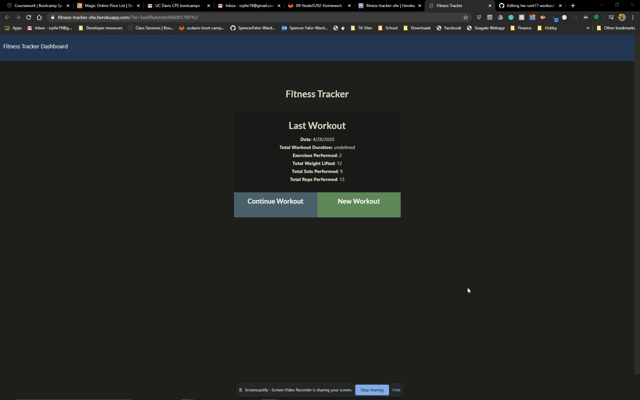

# :boom: [Welcome to SpencerFalor-Ward's Workout Tracker](https://fitness-tracker-sfw.herokuapp.com/) :boom:

   

A simple web based app for tacking your cardio and resistance workouts

## Table of contents

-   [Installation](#Installation)
-   [Usage](#Usage)
-   [Liscence](#Liscence)
-   [Contributing](#Contributing)
-   [Test](#Test)
-   [Questions](#Questions)
-   [Contact](#Contact)

## Installation

npm install the following: mongoose, path, express

## Usage

Input your choice of cardio or resistance and then input your parameters of the exercise and add to your workout. The app will automatically track your exercises.

## Liscence

Licensed under the [MIT License](https://choosealicense.com/licenses/mit/) license.

## Contributing

Always appreciated

## Test

Tested with Postman

## Questions

Git at me if you have any :grin:

## Contact

srfalorward@ucdavis.edu
